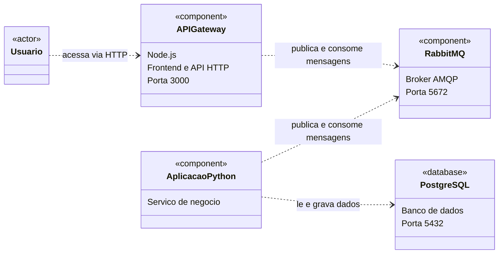

# TP1 - Engenharia de Software

**Nomes**:
  - Felipe Reis Campanha Ribeiro (back)
  - Gabriel Shimada de Oliveira (full)
  - Julia Freitas Fernandes Pires (full)

## Objetivo do Sistema

O sistema consiste em um aplicativo de turismo dedicado à cidade de Belo Horizonte. A idéia é que um administrador tenha acesso a um banco de dados em um servidor e que esse administrador possa registrar diversos pontos de interesse (PDI) e tours, que são coleções de PDIs. Os usuários serão turistas que terão uma versão do aplicativo em seus celulares que mostra um mapa da região com suas localizações e os PDIs de um tour escolhido. À medida que eles andam pela cidade e passam pelos PDIs, estes vão sendo mostrdos como já visitados. Um usuário que selecionou um tour pode também criar um grupo. Usuários podem entrar neste grupo via login e senha e poderão consultar as localizações uns dos outros, bem como os PDIs que visitaram. As localizações serão dadas via simulações e o aplicativo web mostrará um mapa da cidade com os usuários fazendo o percurso.

## Tecnologias

O servidor será uma aplicação em Python dockerizada e que contará com um banco de dados SQL para armazenar os PDIs, tours, logins e senhas.
O front-end será feito com JavaScript e deverá mostrar os PDIs e localizações de cada pessoa no mapa.
A comunicação entre ambos será feita via RabbitMQ ou REST (a decidir).
Como agente de IA, utilizaremos o Gemini para apoiar o desenvolvimento do sistema.

## Histórias de Usuário

1. Como administrador, quero cadastrar pontos de interesse (nome, descrição, localização), para que fiquem disponíveis no sistema.
2. Como administrador, quero criar um tour selecionando uma lista de PDIs, para oferecer roteiros prontos aos turistas.
3. Como turista, quero ver a lista de tours disponíveis e escolher um, para começar meu passeio.
4. Como turista, quero ver no mapa os PDIs do tour escolhido, para saber onde ir.
5. Como turista, quero marcar manualmente um PDI como visitado, para acompanhar meu progresso.
6. Como turista, quero criar um grupo e receber um código único, para convidar outras pessoas ao meu tour.
7. Como turista, quero entrar em um grupo existente informando o código, para acompanhar o passeio com outras pessoas.
8. Como membro de um grupo, quero ver a lista de PDIs já visitados por cada participante, para acompanhar o progresso do grupo.

## Como rodar

Pré-requisitos: [Git](https://git-scm.com) e [Docker Desktop](https://www.docker.com/products/docker-desktop) (aberto e rodando).

1. Baixe o projeto (ou, se já tiver, atualize com `git checkout main` e `git pull`):
   ```
   git clone https://github.com/felipercr/turismo-belo-horizonte
   cd turismo-belo-horizonte
   ```
2. Suba o sistema (banco, RabbitMQ, backend Python e API gateway Node):
   ```
   sh run_server.sh
   ```
   Deixe esse terminal aberto e espere aparecer `API Gateway rodando na porta 3000`
   (o RabbitMQ leva cerca de 40 segundos para ligar).
3. Em outro terminal, na mesma pasta, cadastre os dados de exemplo (pontos e tours de BH):
   ```
   docker exec python_app python tests/populate_db.py
   ```
4. Abra **http://localhost:3000** no navegador.

Para desligar: `Ctrl+C` no primeiro terminal. Para apagar também o banco:
`docker compose -f server/docker-compose.yml down -v`.

Demonstração das histórias 3 a 8 pelo terminal (com o sistema rodando):
`docker exec python_app python tests/demo_historias.py`

**Problema comum:** se o RabbitMQ não ligar com erro de `.erlang.cookie`, rode
`docker compose -f server/docker-compose.yml down -v` e `docker volume prune -f` e suba de novo.

Documentação das mensagens entre frontend e backend: [api/API.md](api/API.md).

## Documentação


